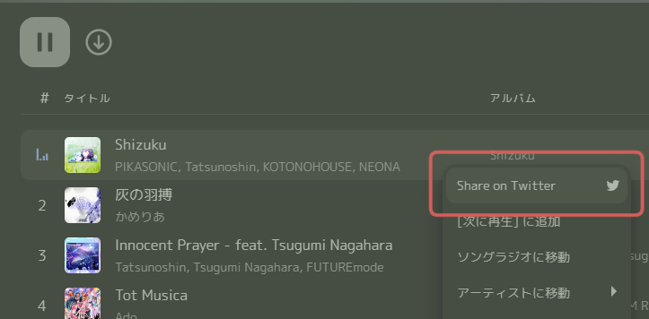
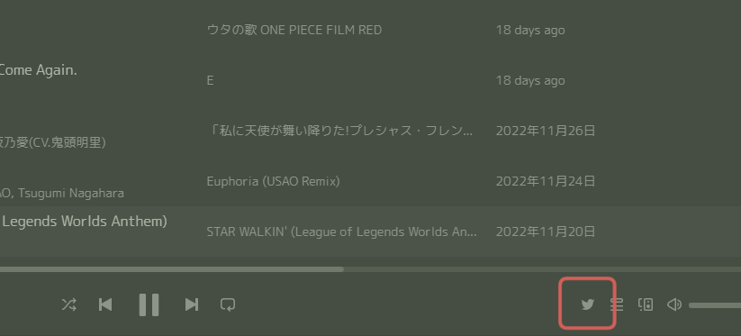

# Share on Twitter

A Spicetify extension to add a button to share music on Twitter.

## Features
- Add share button in the context menu
- Add Tweet button in the control panel
  
*You can hide it from the settings

## Preview



## Install
### Use marketplace
1. Search `share on twitter` on extension tab in [Spicetify Marketplace](https://github.com/CharlieS1103/spicetify-marketplace).
2. Click the install button.

### Manually install
1. Download `dist/share-on-twitter.js` into your Spicetify extensions directory.
2. Run the following command:
 ```
 spicetify config extensions share-on-twitter.js
 spicetify apply
 ```

## Made with Spicetify Creator
https://github.com/spicetify/spicetify-creator